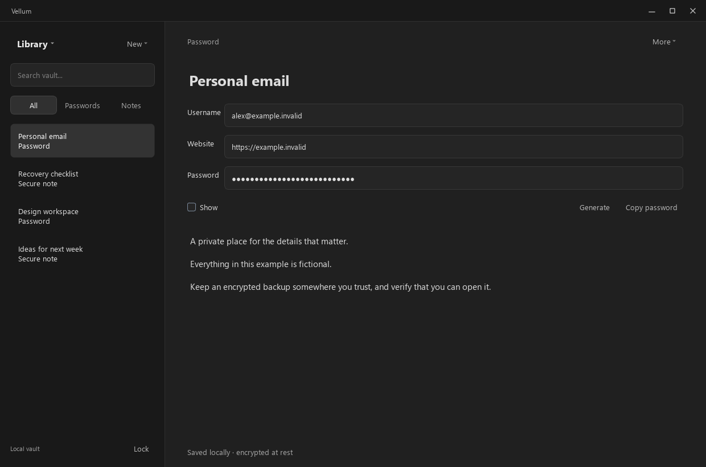

# Vellum

**A private place for your notes and passwords.**

Vellum is a local Windows vault with a minimal dark interface. Keep login details and notes together in an encrypted file, protected by a master passphrase you control. No account or cloud service is required.



> **Early development:** Vellum has not received an independent security audit. Use test data while evaluating it; it is not yet a replacement for an established password manager.

## Features

- **Passwords and notes** — create, search, edit, and organize entries by type.
- **Encrypted storage** — titles, usernames, websites, passwords, and note contents stay inside the encrypted vault.
- **Local generation** — generate random passwords or a seven-word master passphrase.
- **Encrypted backups** — make a separate vault copy that opens with the same passphrase.
- **Optional recovery copy** — explicitly export your master passphrase for safekeeping.
- **Session locking** — manual lock, inactivity timeout, and Windows lock/suspend handling.
- **Clipboard timeout** — copied secrets are cleared after 20 seconds if the clipboard has not changed.
- **Focused interface** — a searchable sidebar, document-style notes, and frameless dark windows.

## Get started

From a packaged build, extract the entire archive and open `Vellum.exe`. Keep the accompanying DLLs and `platforms` folder beside it. When building from source, use `Start Vellum.cmd` or `desktop/Vellum.exe`.

1. Select **Create new** and choose a location for your `.vault` file.
2. Enter and confirm a master passphrase, or select **Generate passphrase**.
3. Continue to the recovery step. Save a recovery copy or confirm that you have kept the passphrase somewhere safe.
4. Select **Create vault**.
5. Use **New ? Password** or **New ? Secure note** to add an entry. Save edits with **Save changes** or **Ctrl+S**.

To return to an existing vault, select **Open vault** and enter its master passphrase.

### Backups and recovery

Use **Library ? Create encrypted backup** to write a new backup file. Verify it by opening it with your master passphrase. Keep a backup on a separate trusted device; another file on the same disk will not protect against disk loss.

**A recovery copy is different from an encrypted backup.** It is an **unencrypted text file containing your actual master passphrase**. Anyone with that file and your vault can unlock the contents. Keep it separate from the vault and its backups.

There is no password reset or recovery service. Losing your passphrase and every recovery copy means losing access.

### Keyboard shortcuts

| Shortcut | Action |
| --- | --- |
| `Ctrl+K` | Focus vault search |
| `Ctrl+S` | Save the current entry |
| `Ctrl+L` | Lock the vault |

## Build from source

### Requirements

- Windows x64
- Visual Studio with the **Desktop development with C++** workload
- CMake 3.25 or newer and Ninja, available on `PATH`
- Qt 6.10.3 for MSVC x64, including Core, Widgets, and Test
- [libsodium 1.0.22 MSVC binaries](https://github.com/jedisct1/libsodium/releases/tag/1.0.22-RELEASE)

Place the libsodium package so these paths exist:

```text
.deps/sodium/libsodium/include/sodium.h
.deps/sodium/libsodium/x64/Release/v143/dynamic/libsodium.lib
.deps/sodium/libsodium/x64/Release/v143/dynamic/libsodium.dll
```

Open an **x64 Native Tools Command Prompt for Visual Studio**. Set `QT_ROOT` to your Qt MSVC installation, then configure and build:

```bat
set "QT_ROOT=C:\Qt\6.10.3\msvc2022_64"
cmake --preset windows-release
cmake --build --preset windows-release
ctest --preset windows-release
```

Install the runnable app and its runtime dependencies to `desktop/`:

```sh
cmake --install build/windows-release
```

Create a distributable ZIP with CPack:

```sh
cpack --preset windows-release
```

The archive is written to `build/windows-release/`. It includes the runtime libraries, platform plugins, documentation, and dependency notices. Build configuration and packaging are defined entirely in CMake.

### Tests

The test preset runs both storage and interface regression suites. They cover encrypted round trips, tampering, incorrect passphrases, backup recovery, concurrent writers, entry editing, setup validation, recovery export, failed-save retries, and simulated session locking.

To rerun the compiled tests with the same `QT_ROOT` setting:

```powershell
ctest --preset windows-release
```

An isolated preview mode renders fictional data into a new output directory:

```powershell
./desktop/Vellum.exe --self-test --data-dir ./test-artifacts/preview
```

Use a fresh directory each time. These are offscreen renders, not verification of live Windows compositor behavior.

## Security and limitations

Vellum uses **Argon2id** for key derivation and **XChaCha20-Poly1305** for authenticated encryption through libsodium. The complete entry payload and its metadata are encrypted. Writes use atomic file replacement, and backups never overwrite existing files.

The application and file format still need independent review. Clipboard handling, operating-system integration, memory exposure, and backup management all affect security beyond the encryption itself. See [the security model](docs/SECURITY.md) for implementation details and known limitations.

This version does not include device sync, browser autofill, passkeys, or a password-reset service.

## Built with

C++20 · Qt Widgets · libsodium

Master passphrase generation uses the [EFF Long Wordlist](https://www.eff.org/dice). See [third-party notices](THIRD-PARTY-NOTICES.txt) for attribution and dependency licenses.

